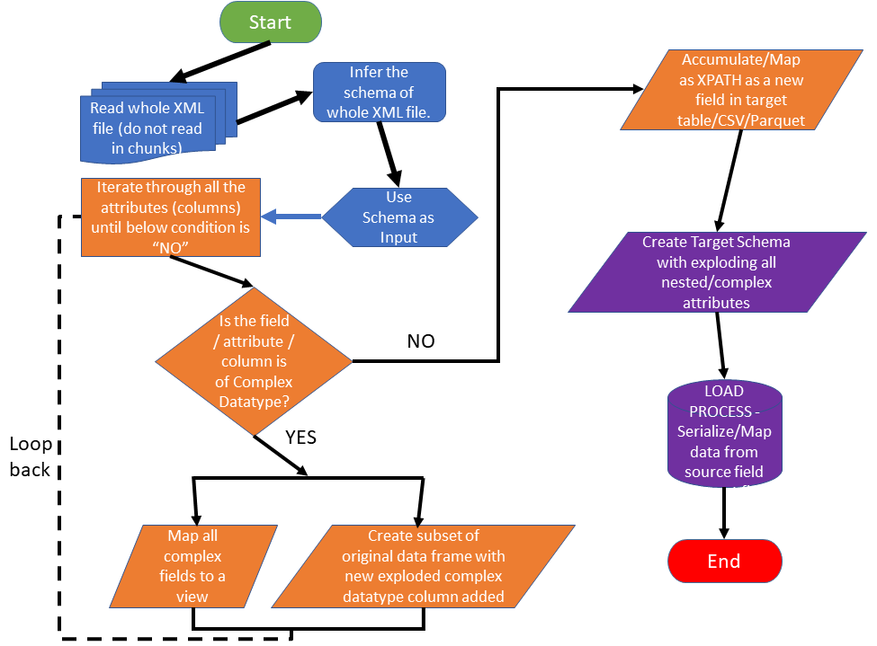

# Datalake ETL Pipeline
Data transformation simplified for any Data platform.

`Features:` The package has complete ETL process - 
1. Uses metadata, transformation & data model information to design ETL pipeline
2. Builds target transformation SparkSQL and Spark Dataframes
3. Builds source & target Hive DDLs
4. Validates DataFrames, extends core classes, defines DataFrame transformations, and provides UDF SQL functions.
5. Supports below fundamental transformations for ETL pipeline -
   * Filters on source & target dataframes
   * Grouping and Aggregations on source & target dataframes
   * Heavily nested queries / dataframes
6. Has complex and heavily nested XML, JSON, Parquet & ORC parser to nth
   level of nesting
7. Has Unit test cases designed on function/method level & measures
  source code coverage
8. Has information about delpoying to higher environments
9. Has API documentation for customization & enhancement

`Enhancements:` In progress -
1. Integrate Audit and logging - Define Error codes, log process
   failures, Audit progress & runtime information

# Datalake ETL Pipeline API documentation
## Mappers for complex/nested data sources
* Has interface `IMapper` and implemented concrete class `XmlMapper`. We
can use same abstract / interface for other category of file mapping
viz. XML/JSON/Parquet/ORC.
* Core methods/function common for overriding
are – `getDataframeSchema`, `createDDL`, `complexTypeIterator`,
`handleStructType`, `handleArrayType`

* Overview of complex type parsing & exploding -
* 
```
def handleStructType(self, viewname, viewpath, database, table, xpath, level, dtype, acc={}, xpaths=[])
```
```
def handleArrayType(self, viewname, viewpath, database, table, xpath, level, dtype: ArrayType, acc={}, xpaths=[])
```
```
def complexTypeIterator(self, viewname, viewpath, database, table, xpath, level, dtype: DataType, acc={}, xpaths=[])
```

### XmlMapper
* `XmlMapper` specific methods / functions – `createViewsAndXpaths`,
  `buildXmlSerdeDDL`

```
def createViewsAndXpaths(self, df: DataFrame, database, table)
```
```
def buildXmlSerdeDdl(self, database, table, xmlsourcelocation, xmlrowstarttag, xmlrowendtag)
```
  
## Pyspark Core Class Extensions

```
from etl.meta import *
```

### Column Extensions

**isFalsy()**

```python
source_df.withColumn("is_stuff_falsy", F.col("has_stuff").isFalsy())
```

Returns `True` if `has_stuff` is `None` or `False`.

**isTruthy()**

```python
source_df.withColumn("is_stuff_truthy", F.col("has_stuff").isTruthy())
```

Returns `True` unless `has_stuff` is `None` or `False`.

**isNullOrBlank()**

```python
source_df.withColumn("is_blah_null_or_blank", F.col("blah").isNullOrBlank())
```

Returns `True` if `blah` is `null` or blank (the empty string or a string that only contains whitespace).

**isNotIn()**

```python
source_df.withColumn("is_not_bobs_hobby", F.col("fun_thing").isNotIn(bobs_hobbies))
```

Returns `True` if `fun_thing` is not included in the `bobs_hobbies` list.

**nullBetween()**

```python
source_df.withColumn("is_between", F.col("age").nullBetween(F.col("lower_age"), F.col("upper_age")))
```

Returns `True` if `age` is between `lower_age` and `upper_age`.  If `lower_age` is populated and `upper_age` is `null`, it will return `True` if `age` is greater than or equal to `lower_age`.  If `lower_age` is `null` and `upper_age` is populate, it will return `True` if `age` is lower than or equal to `upper_age`.

### SparkSession Extensions

**create_df()**

```python
spark.create_df(
    [("jose", "a"), ("li", "b"), ("sam", "c")],
    [("name", StringType(), True), ("blah", StringType(), True)]
)
```

Creates DataFrame with a syntax that's less verbose than the built-in `createDataFrame` method.

### DataFrame Extensions

**applyTransform()**

```python
source_df\
    .applyTransform(lambda df: with_greeting(df))\
    .applyTransform(lambda df: with_something(df, "crazy"))
```

Allows for multiple DataFrame transformations to be run and executed.

## Helper Functions

```python

import etl
```

### DataFrame Validations

**validatePresenceOfColumns()**

```python
etl.meta.validatePresenceOfColumns(source_df, ["name", "age", "fun"])
```

Raises an exception unless `source_df` contains the `name`, `age`, and `fun` column.

**validateSchema()**

```python
etl.meta.validateSchema(source_df, required_schema)
```

Raises an exception unless `source_df` contains all the `StructFields` defined in the `required_schema`.

**validateAbsenseOfColumns()**

```python
etl.meta.validateAbsenseOfColumns(source_df, ["age", "cool"])
```

Raises an exception if `source_df` contains `age` or `cool` columns.

### Functions

**single_space()**

```python
actual_df = source_df.withColumn(
    "words_single_spaced",
    etl.meta.single_space(col("words"))
)
```


Replaces all multispaces with single spaces (e.g. changes `"this has   some"` to `"this has some"`.

**remove_all_whitespace()**

```python
actual_df = source_df.withColumn(
    "words_without_whitespace",
    etl.meta.remove_all_whitespace(col("words"))
)
```

Removes all whitespace in a string (e.g. changes `"this has some"` to `"thishassome"`.

**anti_trim()**

```python
actual_df = source_df.withColumn(
    "words_anti_trimmed",
    etl.meta.anti_trim(col("words"))
)
```

Removes all inner whitespace, but doesn't delete leading or trailing whitespace (e.g. changes `" this has some "` to `" thishassome "`.

**remove_non_word_characters()**

```python
actual_df = source_df.withColumn(
    "words_without_nonword_chars",
    etl.meta.remove_non_word_characters(col("words"))
)
```

Removes all non-word characters from a string (e.g. changes `"si%$#@!#$!@#mpsons"` to `"simpsons"`.

**exists()**

```python
source_df.withColumn(
    "any_num_greater_than_5",
    etl.meta.exists(lambda n: n > 5)(col("nums"))
)
```

`nums` contains lists of numbers and `exists()` returns `True` if any of the numbers in the list are greater than 5.  It's similar to the Python `any` function.

**forall()**

```python
source_df.withColumn(
    "all_nums_greater_than_3",
    etl.meta.forall(lambda n: n > 3)(col("nums"))
)
```

`nums` contains lists of numbers and `forall()` returns `True` if all of the numbers in the list are greater than 3.  It's similar to the Python `all` function.

**multi_equals()**

```python
source_df.withColumn(
    "are_s1_and_s2_cat",
    etl.meta.multi_equals("cat")(col("s1"), col("s2"))
)
```

`multi_equals` returns true if `s1` and `s2` are both equal to `"cat"`.

### Transformations

**snakeCaseColumnNames()**

```python
etl.meta.snakeCaseColumnNames(source_df)
```

Converts all the column names in a DataFrame to snake_case.  It's annoying to write SQL queries when columns aren't snake cased.

**sort_columns()**

```python
etl.meta.sort_columns(source_df, "asc")
```

Sorts the DataFrame columns in alphabetical order.  Wide DataFrames are easier to navigate when they're sorted alphabetically.

### DataFrame Helpers

**columnToList()**

```python
etl.meta.columnToList(source_df, "name")
```

Converts a column in a DataFrame to a list of values.

**twoColumns2Dictionary()**

```python
etl.meta.twoColumns2Dictionary(source_df, "name", "age")
```

Converts two columns of a DataFrame into a dictionary.  In this example, `name` is the key and `age` is the value.

**toListOfDictionaries()**

```python
etl.meta.toListOfDictionaries(source_df)
```
Converts an entire DataFrame into a list of dictionaries.
