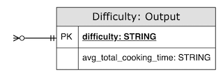

# Before you begin

# About data: Data exploration

- Data is in .json file & in JSON format - `key:value`
- JSON records are in single line minified document
- Data contain non-ascii characters - need to pre-process by reading as UTF-8
- JSON data is not nested. Meaning, there's no column/field that has complex datatype viz. `Array`, `Struct` etc. and
  values are not multi-dimension
- The keys in json (potential column names) are not uniform, few columns are camelCase.
  Example: `prepTime`, `cookTime`, `datePublished`. This needs to be standardised in preprocessing to all lower case,
  words in names should be separated by underscore
- Column potential datatypes:
  - `datePublished` column is in `yyyy-MM-dd` date format but initally read as `string`
  - `cookTime` & `prepTime` are in ISO8601 format potentially `P%P`, `PTnHnMnS` or `PnnYnnMnnDTnnHnnMnnS`; where `n` is
    digit representing `hours`, `minutes` & `seconds`
- Data needs to be read as `files` from given `location`
- Need to be careful & not hit URLs in data. Data has URLs in columns `image` and `url` need to be careful, may navigate
  to phishing links

# Assumptions / considerations
- Primary / Natural keys: `name`. We shall assume name of recipe can be unique in entire data.
  In case scope increases later & same recipe has small modifications in ingredients or steps, we can also consider combination of `name` & `datePublished` as primary keys.
  But for this problem statement we will go ahead with `name` of recipe as Primary Key
- Not null columns: `name`, `cookTime`, `prepTime` as these columns are required for transformations, these columns should have valid values
- We also see `NULL` values in columns `name`, `cookTime`, `prepTime` which will make transformations break. Hence, for `cookTime` and `prepTime` having NULL values we will consider default value as `PT` means 0 preparation/cooking time. Will do this through coalesce or case statements.

# Problem statement & Solution Approach
### Problem statement
- A JSON file has recipes data which on high level contains recipe details, duration to prepare & cook.
- Determine `total_time` (inclusive both preparation time & cooking time)
- Determine `difficulty` based on `total_duration` cases <30mins `easy`, `medium` >=30 <=60 and `hard` >60
- Determine `average_total_cooking_time` per `difficulty`
- Attempt to work on solution using python & spark

### Solution Approach
- Task1: Read the JSON data into spark dataframe
- Task1: Apply data standardization pre-processing transformations best practices.
  - Uniform Column names viz. `cookTime` as `cook_time`
  - Cast columns to proper data types viz. `datePublished` as DATE, `recipeYield` as INT, `ingredients` as ARRAY<
    STRING> split by new line character (\n)
  - TRIM the values in rows to avoid data discrepancy issues & for correct joins, grouping etc.
- Task1: Write the pre-processed data as `parquet` into output folder
- 
- Task2: Read the data from output folder that was pre-processed & stored as parquet in `Task1` to begin
  transformations.
- Task2: Transformation To calculate `total_time`:
  - `cook_time` & `prep_time` are in ISO format.
  - Use `isodate` package to convert them to `timedelta` so that we can do arithmetic calculations viz. addition
  - After converting derive new column `total_time` by adding `cook_time` and `prep_time`
  - Convert `total_time` back to ISO format
- Task2: Transformaion To derive `difficulty`:
  - This can be achieved using case conditions checking for given cases like below
  - Derive `difficulty` by below cases:
    - `easy` - `total_time` <30mins
    - `medium` - <=30 `total_time` <=60
    - `hard` - `total_time` >60
  - Note: convert `total_time` to `timedelta` to be able to do arithmetic calculations on time datatype
- Task2: Transformation To derive `average_total_cooking_time`:
  - Group by `difficulty`
  - Aggregate all `total_time` values into list by aggregation function `collect_list`
  - Perform average calculation on collected list of `total_time`
- Task2: Write transformed data into ouput folder as `csv`
- 

# Instructions to run the application
## Pre-requisites

Apache Spark runs on Java 8/11/17, Scala 2.12/2.13, Python 3.7+.
Install below SDKs to begin the setup

- JDK 1.8 / 8 or JDK 11
- Python 3.9.5 or greater
- [PyCharm IDE](https://www.jetbrains.com/pycharm/download/) community edition is used for implementation (optional)

<details>
<summary>Project directory structure(click to expand)</summary>

<a name="project-directory-structure"></a>
</details>

### Clone the repository into your local machine using IDE or Git

- Use branch [`main`]()

##### 🔴 IMPORTANT Note❗: After cloning, switch to project directory. All the steps must be executed from root directory of project `vim89-data-engineering-test`

### Virtual Environment setup

#### Automated setup (recommended)

This is the preferred way to install virtual environment.

- Run below command to setup virtual environment
- The `setup.py` itself has a bash script call to setup virtual environment

```shell
python3 setup.py install --user
```

#### Manual
If for some reason, the `setup.py` does not work, the steps below show the manual installation route.

A convenient installation using `bash` is available as:
```shell
chmod +x -R sbin
sbin/create_python_venv.sh -n [name of virtual environment]
```
```shell
sbin/create_python_venv.sh -n data-engg
```

### Running Unit Tests

Add environment variables to work on Virtual environment `data-engg`

```shell
export PYTHONPATH=${PYTHONPATH}:"./src/"
export VIRTUALENVWRAPPER_PYTHON="$(which python3)"
export WORKON_HOME="$HOME/python_venvs/"
export PROJECT_HOME="./"
source virtualenvwrapper.sh
source "$HOME/python_venvs/data-engg/bin/activate"
```
Run unit tests using below command
```shell
coverage run -m unittest discover tests
```
Review unit tests coverage
```shell
coverage report -m --omit="*site-packages/*"
```

### Running the data pipeline

#### Using spark-submit

We have a spark-submit [script](../sbin/execute-tasks-spark-submit.sh) created with predefined arguments in the script

```shell
chmod +x -R sbin
sbin/execute-tasks-spark-submit.sh
```

#### 🔴 Check [output](../resources/data/recipes/output) folder for the output of Task1 & Taks2 of the test assignment & review❗

# Requirements covered

- [x] Well structured code, packaging & organized [project directory structure](#project-directory-structure)
- [x] Resiliency and scalability - The solution will work on huge data considered performance tuning options
- [x] Runnable locally using virtual environment and on able to deploy
  on [docker](../.github/workflows/build-test-python-docker-push.yml)
- [x] Unit test cases - with 80+% coverage; [check here](#utc-coverage)
- [x] Exception handling - Use `try` `catch` blocks everwhere and implemeted a reusbale exception logging
  function [log_exception_details](../src/com/vitthalmirji/utils/helpers.py)
- [x] Logging - implemented, configurable, well formatted & all levels of logging both
  at [python](../src/com/vitthalmirji/utils/comprehensive_logging.py) & [spark](../conf/spark/log4j.properties)
- [x] Documentation - All the functions has documentation in comments and ofcourse the current document `ETL_README.md`

# Extras
- [x] Data quality rules, checks & report
  - A basic & generic data quality framework [DataQuality](../src/com/vitthalmirji/utils/data_quality.py) is implemented
    to define data quality rules & perform checks on data.
    
  - This works irrespective of source data or target data
  - Data quality is implemented in the solution to validate both input data & output data please follow the ETL code of solution
  - Execution Reports are written as html, [refer here](../resources/data-quality-reports/recipe-tasks)
  - Sample Data Quality report in html looks like below for task 1 & task 2 respectively
    
    
  - Execution reports are available [here](../resources/data-quality-reports/recipe-tasks) in html file
- [x] Performance tuning considerations
  - Optimise the SQL and source code ensure no cross joins or incorrect join keys and no joins on messed up data that is not preprocessed
  - Ensure to apply filter to avoid full table scan. Spark/Hive has caveat, partition `filter` works only with `WHERE` clause with values.
    - This SQL will scan full data `SELECT * FROM transactions WHERE business_date IN (SELECT business_date IN transaction_refresh_dates)`
    - But this will scan only those required partitions
      ```python
      refreshed_dates = spark.table("transaction_refresh_dates").collect_list()
      df = spark.table("transactions").filter(f"business_dates IN ({', '.join(refreshed_dates)})")
      ```
  - Broadcast join hint in case of smaller (master like) table
  - Shuffle partitions are adjusted/revised to total number of cores across all the executors given for a job.
    A generic function [revise_shuffle_partitions](../src/com/vitthalmirji/utils/spark.py) is implemented in to set
    shuffle partitions,
    which will re-distributing or re-partitioning data so that the data is grouped differently across partitions.
    The number can be reduced or increased according to requirement. Increase shuffle partition number in case of stage
    failures.
  - A generic repartition & coalesce transformation
    function [data_frame_repartition](../src/com/vitthalmirji/utils/spark.py) is implemented
    to evenly distribute the processing across executor & it's cores.
    This also helps to limit the number of output files & uniformly distribute the low cardinality keys.
- [x] CI / CD Pipeline
  - Made use of [github actions](../.github/workflows) to setup CI/CD pipeline
- [x] Orchestration - Scheduling for consistent runs on demand basis
  - `spark-submit` is available [here](../sbin/execute-tasks-spark-submit.sh)
  - we can build python package using `python3 setup.py bdist_wheel sdist` to build package & use options viz `--py-files` to push all source code on cluster with `PYTHONPATH`
  - For more scalability & monitoring interfaces we can definitely go with Airflow
- [x] Configuration management
  - Comprehensive codebase with proper [project directory structure](#project-directory-structure)
  - [sparkConf.conf](../conf/spark/sparkConf.conf) - spark configuration can be passed from `spark-submit` using `--properties` option
  - [log4j.properties](../conf/spark/log4j.properties) to minimize unnecessary logging seggregate logging into different
    files according to package
  - [DQ rules](../conf/data-quality/rules) can be passed in `spark-submit` in `--files`
  - [python level logging](../conf/python/logging-properties.json) (at spark driver level) & log format
- [x] Automation for setting up
  - Use [bash scripts](../sbin) to setup virtual environment on local & on docker

# To Do: Scope for improvement & optimization sections

- [ ] DataQuality framework can be more adaptable, modularized & in well put low level design as implemented quickly
- [ ] Audit logging can be integrated by creating a frameowrk which logs Audit the events in datapipeline to `RDBMS`
- [ ] [Airflow](https://airflow.apache.org/) can be integrated & it's operators
  viz. `BashOperator`, `SparkSubmitOperator` or `hooks` can be leveraged for orchestration.
- [ ] Unit test cases can be improvised to cover most of the code, eventually, right now it is 87%

<details><summary>Unit test code coverage(click to expand)</summary><a name="utc-coverage"></a>

```shell
```

</details>
